# Mermaid Diagrams

Short synopsis, history, adoption, features
Scroll through each of the following

## Chart types

Mermaid support a good selection of diagrams and chart. It also has a modular
structrue that allows for expanson of the collection and interested users to
provide there own additions. The current list of diagrams and charts is:

- Flowchart
- Sequence diagram
- Gnatt chart
- Class diagram
- State diagram
- Pie chart
- Git graph [experimental]
- Bar chart
- User Journey diagram
- C4 diagram

We will briefly review each of these with visual and code examples.

### Flowchart

This is one of the most common types of diagram due to it's veratility, if
you need to diagram something other that the specific types provided you will
likely use a `flowchart` type diagram. We will show a simple example here as
this is one of the types we will use more later on.

#### Diagram
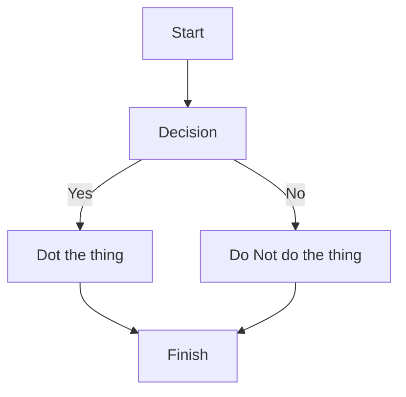

#### Diagram text
```
flowchart TD

start[Start] --> d[Decision]
d -- Yes --> do[Dot the thing]
d -- No  --> doNot[Do Not do the thing]
do & doNot--> fin[Finish]
```

[live editor](https://mermaid.live/edit#pako:eNpVkLFuwjAQhl_FuqETEEjaABk6pd3KQpcqZjC2k1hNfMi-tEIo794LlEodbN3933eSzxfQaCwUUHf4rVsVSLyX0ksfietqP90HMZ8_C1OVVrvo0B-kNxyJDxtvBKsSSVBr-Tjf3PkOxS_fIbHCAXHzX0TxcBMms3a-enXexZYRzKC3oVfO8PMu0gshgUd7K6Hg0qjwKUH6kT01EO7PXkNBYbAzGE5GkS2daoLqoahVFzm1xhGGt9u-17Xv5suV_IkdKmO5vQCdT5PcuEgsa_S1a6Z8CB3HLdEpFkky4UXjqB2OC419Ep2ZfrL92uZJnuYblWY2X2fqKcuMPq62mzp9XNVmvVylCsZx_AHn5IDg)

### Sequence diagram

Sequence diagrams are great for visualizing which actors interact with which
and what order the sequence proceeds in. Let us have a look at this type by
showing the implicit auth flow for OIDC.

#### Diagram

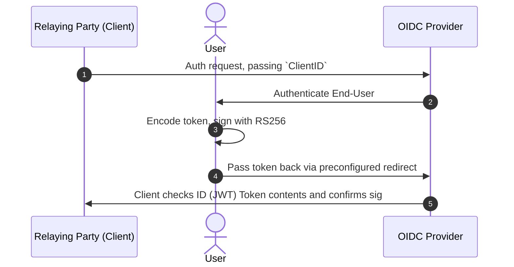

#### Diagram text

TODO: Look into why this block is rendering as a diagram

```
sequenceDiagram
    autonumber
    participant client as Relaying Party (Client)
    actor user as User
    participant provider as OIDC Provider
    client->>provider: Auth request, passing `ClientID`
    provider->>user: Authenticate End-User
    user->>user: Encode token, sign with RS256
    user->>provider: Pass token back via preconfigured redirect
    provider->>client: Client checks ID (JWT) Token contents and confirms sig
```

[live editor](https://mermaid.live/edit#pako:eNptkk1P40AMhv-KNSeQCt2mS4AckFa0h6602gpY7SUH3Bk3GTWZZOejqKr63_FkAgixuSSxH79-PZ6jkJ0iUQhH_wIZSQuNlcW2NMAPBt-Z0G7Ipv8erddS92g8yEYTv9DBAzV40KaCNacPcHY_ZM5HCek7C8GRjegf9z-p3nZ7rRLxe7W4h_UYSGjqdHF398YV8CP4Gmy07PyEtZyL_Z9T59Xieewx8lwaDaQyBrRET7A06uLDTwTeuaWJpwK-25GZgNOVgRfNHR8es6v8E_9hac0mUgVsUO5gr5ENkOzMVlfBkmK_SnPAfzGXBiwg2QdZk9w5WC3g7Offp3N4GkRZyHPWARoFg6ptXfQmJqIl26JWvMZjFC8Fj9lSKQr-VGh3pSjNibm4z8eDkaLwNtBEhF7xSYwrF8UWG8dRtsk7-5XuxXA93sjlkHkHmw55AFEchT_0Ea608wynmWM82IbDtfe9K6bTmL6s-CDD5lJ27dRpVfM1qPe3-TTP8hvM5pRfz_FqPldyM7u92WbfZ1t1_W2WoTidTq8zUenQ)

### Gantt chart

Gantt charts are similar to the bar charts you ware likely used to but the
bars don't all start at the same place, they are normally used for visualizing
project timing.

#### Chart

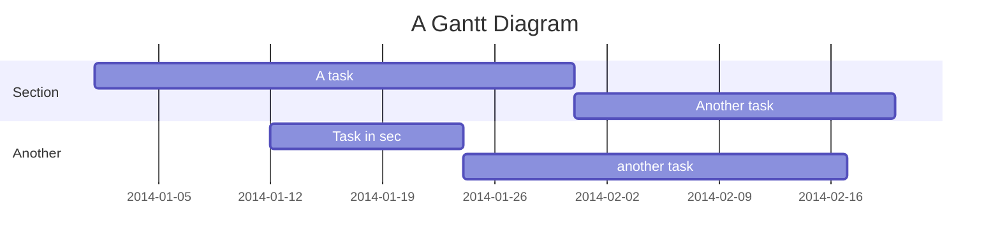

#### Chart text

```
gantt
    title A Gantt Diagram
    dateFormat  YYYY-MM-DD
    section Section
    A task           :a1, 2014-01-01, 30d
    Another task     :after a1  , 20d
    section Another
    Task in sec      :2014-01-12  , 12d
    another task      : 24d
```

[Live editor](https://mermaid.live/edit#pako:eNpdUV1vwiAU_Ss3PKst1NXJm4nbnnxyL0v6ci20JbZg6O0SY_rfB7bObDckwPnICYcbK53STLIaLVFhIQwZajXs4CNCsDdYe-wmSiHpd-c7JICvMMvDYbnfT1yvSzLOwnHaJ3AHhP0ZniORL0CkfL1MeVgLyFI1S62jRvunQWJF4Y4cIFrU35hZPoGf0WNsJOeYRwQX0c3F7Mb_ISBBrBVbsE6HZxkVqrhFacGCrtMFk-Go0J8LVtgx6HAgd7zakknyg16w4RJLmVtissK2D6hWhpw_TN3eK34o3-7Mr7B1qHS43hhdL_ePMD0FcelsZeqID74NcEN06WWSRHpVG2qG06p0XdIb1aCn5nubJ7nIX1FkOt9k-JJlqjzx7Wsl1rxSm5QLZOM4_gCBkJac)

### Class diagram

Class diagrams (UML), primarily used in software development to show class
relationships and capabilities. They can also be used for ad-hoc work such
as emulating [Class Responsibility Collaboration (CRC)](https://en.wikipedia.org/wiki/Class-responsibility-collaboration_card)
cards and terraform module modeling. The following is a rough outline of an
ecs web application module with sub modules for VPC, ECS, ACM.

#### Diagram

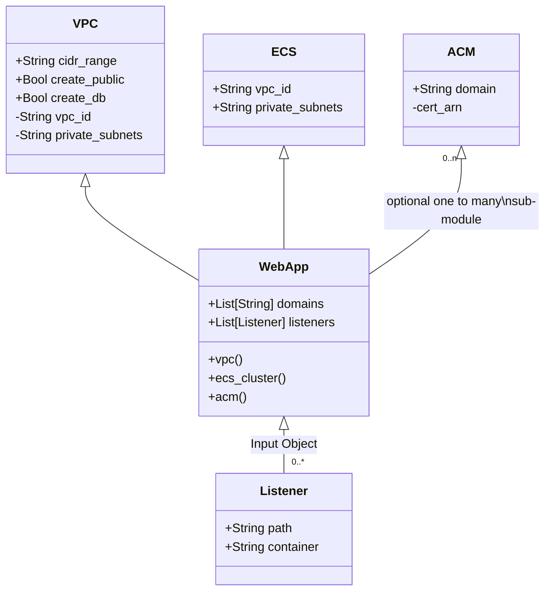

#### Diagram text
```
classDiagram
    TD
    class WebApp{
        +List[String] domains
        +List[Listener] listeners
        +vpc()
        +ecs_cluster()
        +acm()
    }

    class Listener {
        +String path
        +String container
    }

    class VPC{
        +String cidr_range
        +Bool create_public
        +Bool create_db
        -String vpc_id
        -String private_subnets
    }

    class ECS{
        +String vpc_id
        +String private_subnets
    }

    class ACM{
        +String domain
        -cert_arn
    }

    WebApp <|-- "0..*" Listener : Input Object
    VPC <|-- WebApp
    ECS <|-- WebApp
    ACM "0..n" <|-- WebApp : optional one to many\nsub-module
```

[Live editor](https://mermaid.live/edit#pako:eNqVU01vEzEU_CuWT0CbpEkgbVdcStoDEhVIQXDA1cprv-wavLbltSNF6f533sYJXZLlgA_-mBmP5vljR4WVQDMqNG-ae8VLz2tmCLav92ncM-Q7FHfO7RLUtYtPqgk_VsErUz4RaWuuTHNKdx0Y8E9EH2Z9ycaJV697axBNLnREof8L56I-rltm-qmO_qQfLGUijofqHBXWBEwKftDv25flgJNQ0ueemxJ63AdrNREeeIDcxUIr8Q9SFi_E6OCIledKnuPOq023p4mFgdAMZnxYrgYynjpe_Ifj3fJxwDFdaS-jAB9y7s2JR3oZ5P3zaEQYvRqP3zD6cjEZ-WhcDORz8RNESDvwlJM8bU0glnUOYrLkadCzx6KtdUFZwzWxBkiwpOZmy5jBOke1lVHjXdFLWoPHKiQ-8H2FjIYKamA0w6nk_hejzLSo4zHY1dYImgUf4ZJGJ_HUDv-BZmuuG0RBqmD94-HHdMNR-bBn_gi15RJwuaNh6zpxieeBYnx9a1V2ePQa4SoE12STSUePSxWqWIyFrSeNkhX3odrcLiaL2eKGz-awuJ7zd_O5FMX09mY9eztdy-ur6YzTtm1_A49oKoI)

### State diagram

State diagrams are used in computer science and control systems to describe
the behavior of systems. These systems have a finite number of possible states
and each state has a known set of transitions. These can be used to visualize
workflows, process and outline programatic actions. Here we see some of the
possible state transitions for a ticket in Jira.

#### Diagram
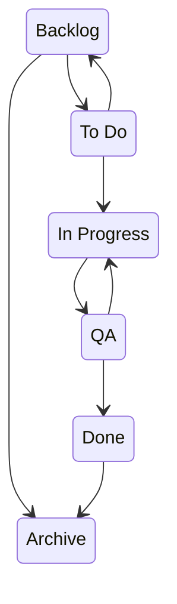

#### Diagram text
```
stateDiagram-v2
    Backlog --> todo
    todo --> Backlog
    Backlog --> Archive
    todo --> inProgress
    inProgress --> QA
    QA --> inProgress
    QA --> Done
    Done --> Archive
    
    todo: To Do
    inProgress: In Progress
```

[Live editor](https://mermaid.live/edit#pako:eNptkMtqwzAQRX_FzDqOG7t1Ei0KKemii0JDu_RmIsm2iC0ZaRwIwf9e-ZEakmo1c-5BA_cK3AgJDBwhyb3CwmIdnuNMB_69IT9VpgjC8DUgI8xI-2lAU_zo7iwv1Vne6Up_WVNY6dwYzPsQH3YjPuz-tSe8N3r6t58er803WfBjvHR_iwUfOrgtsIBa2hqV8BVcezUDKmUtM2B-FGhPGWS68x62ZL4vmgMj28oFtI2YGwOWY-U8lUKRsZ9jp0O1N_N9SP7EyqCQfr0CXZpeLpQjL3Ojc1X0vLWVxyVR41gU9fGyUFS2xyU3deSUKNFSed6mURqnG4wTma4TfEkSwY-r7SaPn1e5WD-tYoSu634B3M2a4g)

### Pie chart

Not much more to be said about the classic pie chart.

#### Diagram

TODO: fix chart size

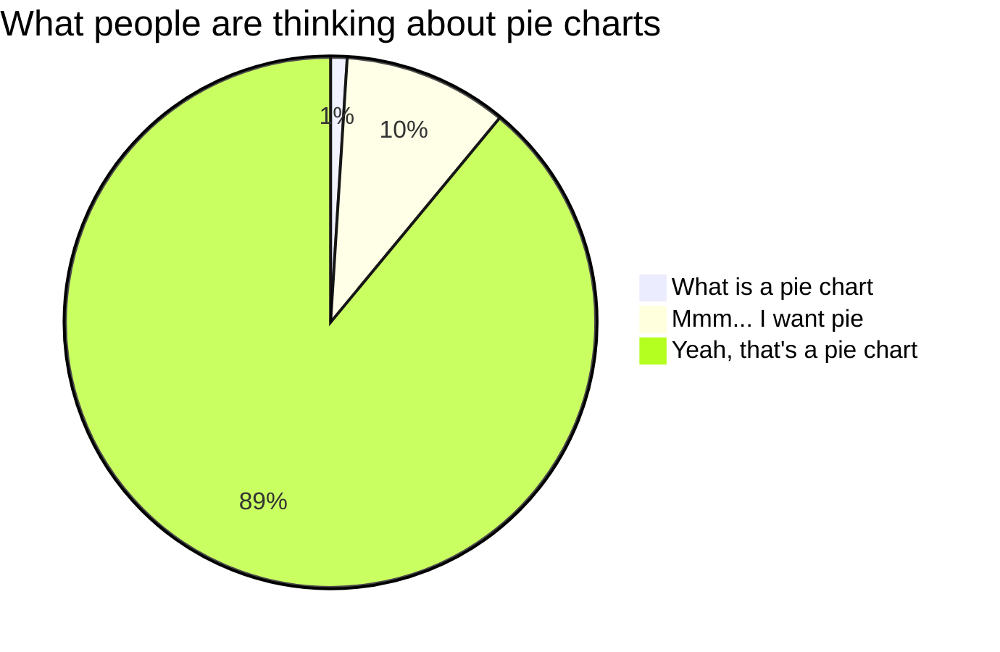

#### Diagram text
```
pie title What people are thinking about pie charts
    "What is a pie chart": 1
    "Mmm... I want pie": 10
    "Yeah, that's a pie chart": 89
```

[Live editor](https://mermaid.live/edit#pako:eNplj7FuhDAQRH_F2iYNggMS7qBOihRXpYgiuVmwwdZhG9lLohPi32OISIq4sufN7HoW6JyQ0MCkJSNNo2TvColN0k3xjj6qStubtgPD1s2RRGOn0FPglsXDYQ_owPCPcWhYfvCrMWmaslf2hXbP7_R04A-JKolbkB7-zbjUkICR3qAW8ZPLluFASpp9CAeB_saB2zX6cCb3drcdNORnmcA8CST5rHHwaKDpcQxRlUKT89ef1nv5w_myk1_j6FDI-FyA7tNmHnSgaO6c7fWw6bMfo6yIptBk2YbTQZOa27RzJgtabDXUZ11lVVFdsChldS7xqSxF1-b1pS8e816cT3mBsK7rN-mhf9w)

### Bar chart

Again, pretty standard stuff... but it's done with a `gantt` type which is
not particularly intuitive.

#### Diagram
```mermaid
gantt
    title Basic Bar Chart (via Gantt)
    dateFormat  X
    axisFormat %s

    section Item 1
    15   : 0, 15
    section Item 2
    20   : 0, 20
    section Item 3
    10   : 0, 10
```

#### Diagram text
```
gantt
    title Basic Bar Chart (via Gantt)
    dateFormat  X
    axisFormat %s

    section Item 1
    15   : 0, 15
    section Item 2
    20   : 0, 20
    section Item 3
    10   : 0, 10
```

[Docs](https://github.com/mermaid-js/mermaid#bar-chart-using-gantt-chart-docs---live-editor)
[Live editor](https://mermaid.live/edit#pako:eNptkD1vgzAQhv-KdVKlVIoCmIYkjP1Uh05dOrBcbANWwUb2ETVC_PcaSDLFw-n83CNb9w4grFSQQ4WGqDAsHNLUKPaMXotQHXup0RFbnTSyj8l6XDSJpN6ta5EY-1kQ_ml_QQ--MAv0SpC2hn2SalmysGQbSs7idejuWHxhPL5aPL5jpZe3blYSwxpaFf7XMqw0TPMCqFatKiAPrUT3W0BhxuBhT_b7bATk5Hq1hr6bFnrVWDlsIS-x8YEqqcm6ryWjOaqr-TZPbmJjUapwHYDO3Ryo9hRkYU2pq4n3rgm4Jup8HkXTeFNpqvvjRtg28lpOMdenQxZlPNsjT1W2S3GbplIck8O-5E9JKXdxwhHGcfwHNC6H8w)


### User Journey

User Journey diagarms are intended to be high level of detail step by step
process charts of existing workflows which can reveal the areas of
imporovement in future workflows.

#### Diagram
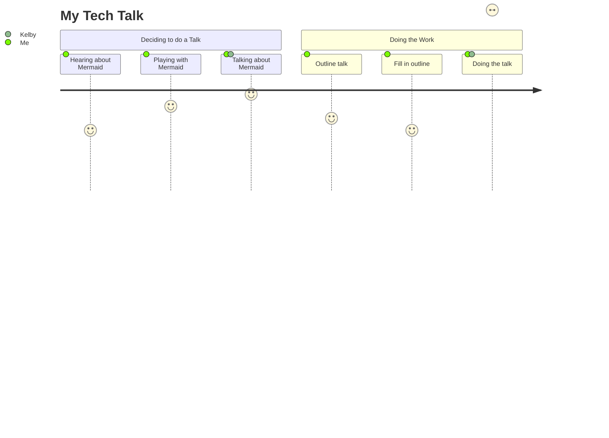

#### Diagram text
```
journey
    title My Tech Talk
    Section Deciding to do a Talk
        Hearing about Mermaid: 5: Me
        Playing with Mermaid: 7: Me
        Talking about Mermaid: 8: Me, Kelby
    Section Doing the Work
        Outline talk: 6: Me
        Fill in outline: 5: Me
        Doing the talk: ?: Me, Kelby
```

[Docs](https://mermaid.js.org/syntax/userJourney.html)
[Live editor](https://mermaid.live/edit#pako:eNptkcFOwzAMhl8lynlaWcu6LRcuAyGhCaRN4rKLm7htIE2m1AVVU9-dZBVsA3Jy7M-_f9lHLp1CLvib67zFfm9ZeKTJINv0bIeyZjsw72N-i5K0s2yNUittK0aOKcfgAonvEcHHKhSuI7ZB34BWgs1FiM_Ui4E-Up-a6jO0uIai8D9Sy0hN2BOaov9lzZ181chenb_w9NyR0RYZBUHB8uspD9oYpi1zI_TH6ll0bL-7GM8nvBlthS0eY8-eB7LBPRchVBBc8L0dAgcduW1vJRfkO5zw7qCAcK2h8tBwUYJpQxaVJuc341lO1_km70-VH9A4UBi-R079IcKVbinA0tlSVzHfeRPSNdGhFUkSy9MqbLsrptI1SatVDZ7qj1We5Gm-hDTDfJHBPMuULGarZZnezkq1uJmlwIdh-AJkDK8O)

### C4 diagram

C4 diagrams are a currently exprimental and the syntax may change but they
seems like one of the most suited to the work that we do. We will only show a
quick example here as this is the other type we will be focusing on below.

#### Diagram
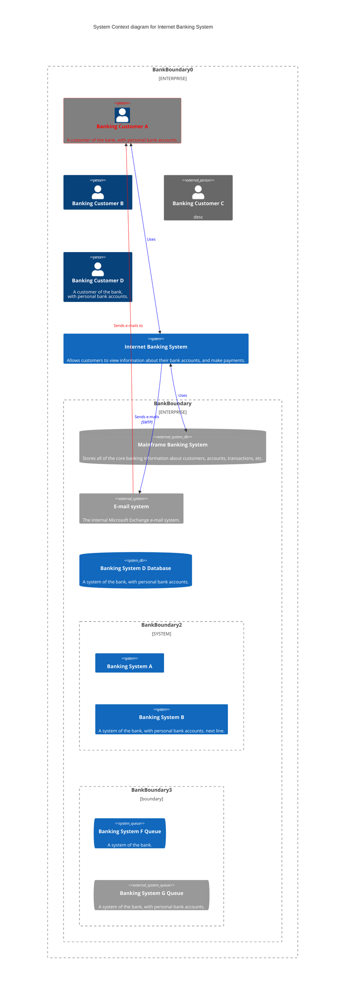

#### Diagram text
```
    C4Context
      title System Context diagram for Internet Banking System
      Enterprise_Boundary(b0, "BankBoundary0") {
        Person(customerA, "Banking Customer A", "A customer of the bank, with personal bank accounts.")
        Person(customerB, "Banking Customer B")
        Person_Ext(customerC, "Banking Customer C", "desc")

        Person(customerD, "Banking Customer D", "A customer of the bank, <br/> with personal bank accounts.")

        System(SystemAA, "Internet Banking System", "Allows customers to view information about their bank accounts, and make payments.")

        Enterprise_Boundary(b1, "BankBoundary") {

          SystemDb_Ext(SystemE, "Mainframe Banking System", "Stores all of the core banking information about customers, accounts, transactions, etc.")

          System_Boundary(b2, "BankBoundary2") {
            System(SystemA, "Banking System A")
            System(SystemB, "Banking System B", "A system of the bank, with personal bank accounts. next line.")
          }

          System_Ext(SystemC, "E-mail system", "The internal Microsoft Exchange e-mail system.")
          SystemDb(SystemD, "Banking System D Database", "A system of the bank, with personal bank accounts.")

          Boundary(b3, "BankBoundary3", "boundary") {
            SystemQueue(SystemF, "Banking System F Queue", "A system of the bank.")
            SystemQueue_Ext(SystemG, "Banking System G Queue", "A system of the bank, with personal bank accounts.")
          }
        }
      }

      BiRel(customerA, SystemAA, "Uses")
      BiRel(SystemAA, SystemE, "Uses")
      Rel(SystemAA, SystemC, "Sends e-mails", "SMTP")
      Rel(SystemC, customerA, "Sends e-mails to")

      UpdateElementStyle(customerA, $fontColor="red", $bgColor="grey", $borderColor="red")
      UpdateRelStyle(customerA, SystemAA, $textColor="blue", $lineColor="blue", $offsetX="5")
      UpdateRelStyle(SystemAA, SystemE, $textColor="blue", $lineColor="blue", $offsetY="-10")
      UpdateRelStyle(SystemAA, SystemC, $textColor="blue", $lineColor="blue", $offsetY="-40", $offsetX="-50")
      UpdateRelStyle(SystemC, customerA, $textColor="red", $lineColor="red", $offsetX="-50", $offsetY="20")

      UpdateLayoutConfig($c4ShapeInRow="3", $c4BoundaryInRow="1")
```

[Docs](https://mermaid.js.org/syntax/c4c.html)
[Live editor](https://mermaid.live/edit#pako:eNqdVm1r2zAQ_itC5EMLaV7brgvbIG8dgxW6pYMNAkW2z4moLQVJXhtK_vtOstXYjrNuzZfW5-fRc4_vdNIzDWUEdEQJ_qbnUykMPJmlIO5nuEmALLbaQEqKdyTibKVYSmKpyBcMKQGGTJh44GJVYD1_bl9vFNdwP5GZiJjangS9NllSi_eh3pKekmfPIeQWlJbiJMy0kSmoscfb9adFkIyX1MbHxMOIjIlZAwkQ2SaP3KzJxi3EEhcjLAxR0OgOyh0VmzSKTRoo9_Mn80KbNtKmeY4R6NAtcFR11kif_d3ih0B1P71udC-a1-Yk_zN2n_VY_XLhJJGP-kVdEyPJbw6PhAusfcoMl4KwQGbGZsVVVb1NmIhIyh6AbNg2hYaEGtujX2-Pojv2NO9kFrga5A9zS7thmBr2JjT6WRipQBOWJP5DhhhwWVvooasX5-2SK6OY0Cy0MHwCE9Zd-fRKngZ1T4Nayx-Wp9wRxQYcV7rwgDJpoEx8C-n8-Z_3CBF2qydcQKemumv0ui-E2wrzs5TxpFDNc7hDXe7aDcVueKiklrEh86dwzcQKCJQpdVFf8EJj1mB1RmbMsIBpeKvngzruCzisF3CYiwTVHj2szbcMMiiyvm7I-po4xPGUO0eK7milz_65YfHPry3-H3PSFf7g31IzTPh3SMpDuzxnfmjQpeVy7B5Q2sI1ZBPOddgCRKSLptHF_r65u22kIqFymFS4ONUqhf-xiZiBeQJ2ZC3MNoGyqVaMp-BUJlJ9XFIFkVVuBSsfWSnY5iGpIjwWysDTqgKmd7D63mnLHrWeHiR5EVt2Px4EZRxrMD8xdHFcpOFb_7fELwyd9Xv_LjJ9q8h5r-bs7OJV2WqRK7q-TmVZH6tpVPIY9Bo64yvb4tmAl6GYr05a4flizTbwRXyXj8hwYwGDfkz4eB8Xom2KuWHPRXjdcsNiSXEjpuh-ZG8JTD0s6VLsEMcyIxdbEdKRURm0aeaUZ_nFi45ilmiMQsTxRLvJ72_uGueRc_fmBZhIhs1IR8_UbDcWvOLaIDh0Jmw8UwmG18Zs9Kjbta87K5wMWdAJZdrVPFozZda_3192LweXV2wwhMt3Q3YxHEZh0H9_FQ_O-3H0rtcfMLrb7f4ASMFYVA)

## Integrations

None of this would do us much good without a handy way to work with these
diagrams. Luckly for us the community has provided a number of [integrations](https://mermaid.js.org/ecosystem/integrations.html)
. The first one that caught my eye was github, specifically github markdown
rendering supports Mermaid diagrams. This was enough industry buy-in to get
me interested. Some further looking shows extensive support, Github, Gitlab,
GitBook, Atlassian products including Confluence and Jira. Further is is
supported by most common editors, wikis, browser via plug-ins, several CMS,
wikis and note taking systems.

We will be taking a close look at the integrations that look most important
to our work here in Elevated. That means browser plug-ins for local work. The
github markdown integration that allows us to use Mermaid for quick visuals
in repo docs and README files. Jira integration which would allow us to
clarify our work with quick diagrams. 

### Local markdown

This is what I use most, it allows for rapid iteration of diagrams and the
associated documentation in markdown format. To view local files I make use
two browser plug-ins, the first reders markdown, the second adds Mermaid
diagrams to that markdown. [GitLab Markdown Viewer](https://github.com/painyeph/GitLabMarkdownViewer)
is a simple GitLab syntax markdown viewer. [Markdown Diagrams](https://github.com/marcozaccari/markdown-diagrams-browser-extension)
extends markdown with the diagram support. Together they provide a solid base
to view rendered versions of the documentation you are working on.

# TODO: fix link
< IMAGE LINK - downloads/Screenshot-Local-Markdown-Mermaid>

#### Plug-ins

[GitLab Markdown Viewer](https://github.com/painyeph/GitLabMarkdownViewer)
[Markdown Diagrams](https://github.com/marcozaccari/markdown-diagrams-browser-extension)

### Github markdown

Native support in github README was *the* feature that made me think this
would be a tool worth looking into. This means that all of our client facing
modules that we deploy, all of the lambda functions that we package, scripts,
tooling, ect. can benifit from diagrams with no extra effort. The following
screenshot is from a github rendered README.md file with nothing done other
than add the block with the language of `mermaid`.

# TODO: fix link
< IMAGE LINK - Downloads/Screenshot-Github-Markdown-Mermaid >

### Jira

This one is rather speculative at the time of this writing. I have put in a
request to have the add-on installed in Jira to allow for the display of
rendered Mermaid diagrams. This could be a signifigant aid in communicating
intended architectures, application or communications flows and outcomes to
clients. The plugin proports to

> Automatically converts mermaid chart definitions into images that will be
> uploaded in-place to Jira on your behalf.

#### Plug-ins

[jirafs-mermaid](https://github.com/coddingtonbear/jirafs-mermaid)

### Live editor

This is the go-to for working up examples and active coloboration. While I
like the local workflow for my documentation work when brainstorming this is
the place to be. Live rendering of changes allows for rapid iteration of ideas
and their representation.

#### Example

[Simple flowchart](https://mermaid.live/edit#pako:eNpVkFFvwiAUhf8K4WlL1M52q9qHJbM6X1y2ZL61fbgCLcQWCKUzpu1_H2hMNp4u53wHbk6PiaIMJ7is1ZlwMBYdNrlE7rxlKTeitQ20BZpOX4cds6hRkl0GtH7YKdRypbWQ1eONX3sIpf3eYwxZLuRpvFnpNf8p2YA22R60Vbr46xzOakDbTHxx9_x_hxvmUu9ZCUkJUwIGpWAKPMENMw0I6lbvfSDHlrOG5ThxIwVzynEuR8dBZ9X3RRKcWNOxCe40Bcs2AioDzV1kVFhlPm5VXBu5g9urg93ndevAWgFl7tpje9EerlxDDiZKlqLyemdqJ3NrdZsEgbdnlbC8O86IaoJWUF8y_1nFQRzGSwgjFi8ieIkiSo7z1bIMn-clXTzNQ8DjOP4CDjyGpw)

## My workflow

My normal workflow thus far is to do my local documentation development in my
editor of choice (vim) and when/as needed view the results in the browser.
This is done using a local `file://` path which is rendered with the
previously mentioned browser plug-ins. When I am satisfied with my docs they
are pushed to github and I validate the rendering there to assure that no
unexpected changes or issues arise in the non-local render.

## Most relevant types

### Flow chart

Flowcharts are extremely versitile and can be used to document infra or
application architectures, workflows, organization processes. These are declared
with the type `flowchart`. Flowcharts can
have one of several orientations , top down (`TB`, `TD`), botton to top (`BT`
), right to left (`RL`) and left to right (`LR`). This notation follow directly
after the diagram type declaration. Following this we have nodes in the format
of `id["Label/Description"]`. The `id` is the refernce we will use to draw
links between the nodes. Following the nodes is the links (`idA--> idB`), links
can optionall have text (`idA -- "Reason link exists" --> idB`). A lot more can
go into a flowchart than this but this is enough to get us started. For further
details please see [the docs](https://mermaid.js.org/syntax/flowchart.html).

#### Architecture Example

Here we will see a basic three tier web app as deployed in AWS from the high
level. We also see a new concept, `subgraph` this is simply a bounded context.
It is what draws the box around a set of components to indicate they are in
the same conceptual space or in a distinct space from other componenets.
Additionally we see a new shape for the DB node. A [good selection of shape
options are listed in the docs](https://mermaid.js.org/syntax/flowchart.html#node-shapes)
.

##### Diagram

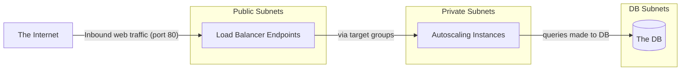

##### Text

```
flowchart LR
	internet["The Internet"]
	ALBs["Load Balancer Endpoints"]
	ASG["Autoscaling Instances"]
	DB["The DB"]

	internet-- "Inbound web traffic (port 80)" -->ALBs
	subgraph public-subnets[Public Subnets]
		ALBs
	end
	subgraph private-subnets[Private Subnets]
		ALBs-- "via target groups" -->ASG
	end
	subgraph db-subnets[DB Subnets]
		ASG-- "queries made to DB" -->DB
	end
```

#### Workflow Example

Here we see a basic workflow or descision tree, in this case it is a way to
make descisions on terraform modules. Here we see some more shapes and a new
way to link nodes. We can draw more than one link in a line with the node
arrow node arrow node syntax. Additionally we see nodes with text being
defined inline with the links. 

##### Diagram

```
What do I pick module workflow ?
- Search Terraform Modules. 
  - Is there an existing community module ? 
    - Is it AWS ? Evaluate, Try to use. Fork?
    - Is it competitor ? Evaluate, Try to use. Fork?
    - If nothing, create own internal with reasoning ?
      - Use Jakes syntax in confluence ?
      - Make Public ?
```

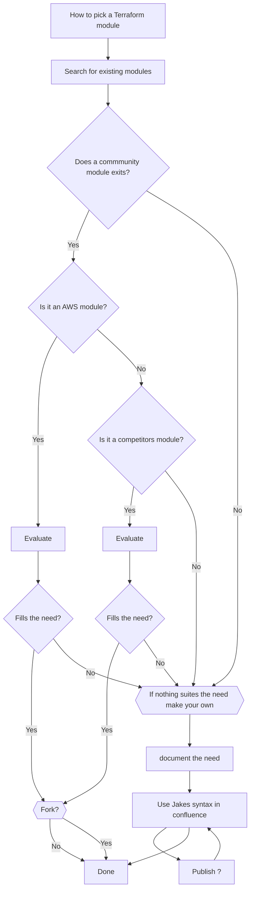

##### Text

```
flowchart TD
    start["How to pick a Terraform module"]
    search["Search for existing modules"]
    cmMod{"Does a commmunity module exits?"}
    cmAWS{"Is it an AWS module?"}
    cmCPT{"Is it a competitors module?"}
    diy{{If nothing suites the need make your own}}
    done["Done"]
    
    start-->search
    search-->cmMod
        cmMod-- "Yes" -->cmAWS
        cmMod-- "No" -->diy
    
    cmAWS-- "Yes" -->awsEval["Evaluate"]
        awsEval-->awsFill{"Fills the need?"}
        awsFill-- "Yes" -->Fork
        awsFill--"No"-->diy
    
    cmAWS-- "No" -->cmCPT
    cmCPT--"Yes"-->cptEval["Evaluate"]
        cptEval-->cptFill{"Fills the need?"}
        cptFill--"Yes"-->Fork
        cptFill--"No"-->diy
    
    cmCPT-- "No" -->diy


    diy-->doc["document the need"]
        doc-->creat["Use Jakes syntax in confluence"]
        creat-->publish["Publish ?"]-->creat
        creat-->done
    
    Fork{{"Fork?"}}--"No"-->done
    Fork--"Yes"-->done
```

[Live editor](https://mermaid.live/edit#pako:eNqNlG9v2jAQxr-K5delDNhoy4tN02i1TupUCaZpavrCxA6xiO3IPpdGEd99d0mA0HbVgoSdu5-d5zn_qXnqpOIznhVum-bCA1vOE5tAAOw_JPy72zJwrNTphgm2VN6LzHnDjJOxUAl_TCzDJyjh0xz5RdNhyDD1rANou-7YcIBTc-dknfC5UwEnTZ0xJloNVUfSSAhfEr7b819_L5C_DUwDE5bha4f2oW_3yyNEs5YKNDgfXrFSV3V9mzHrICeBIWpAKZArZpWSzIiNYpWLnrmt3e0HOaseSLQ92u7MU60Gg89tEfoFwWBjto0dvA8GLOF_qCKsIdDPW8RP1wIot_-5hj-dQmzD9ZMoUB41UcBRIj1dugVvdFFgnag5Wj7WpuMpffqNG-c3byCtzPdU7m00K9RbLBrbzE65Et4z0KVb8D8MdFT_C6fye8C_5DcKX64C_bodRCGXomL8j0ZZOGg5kY5Zku2VoOP0Kyj2A3dXYKGyIJ6ZtrhTbVZEZdMXnmkIDi3jqtCBztZ922Po9XE_52ue9mnfCRmvqV7YUpV2fdMHlrL9crUZfsaN8kZoiVdETWTC0aVBpTPsSoE15YndISciuEVlUz4DH9UZj6XEVZxrsfbC8FkmioBRJelE3rV3TnP17MnrJnMACyekwteaQ1USvMbLBGEqll5TPPoCwzlAGWbDIaXP1xryuDrHoz8MWtJtlj9dTYfT8fRSjCdqejERnyYTma5GV5fZ-OMokxcfRmOBNdn9BcDvlP0)


#### Organization Example

Let's now take a quick look at how we can capture organizational logic in a
diagram. For this example we will look at escilation points in Elevate. We
have links to subgrpahs, nested subgraphs and stand alone nodes. Also note the
bottom to top order and the ability to declare a direction in a subgraph as is
shown in the `internship`. We also see a title added to this diagram, titles
must be the first element in a diagram.

##### Diagram

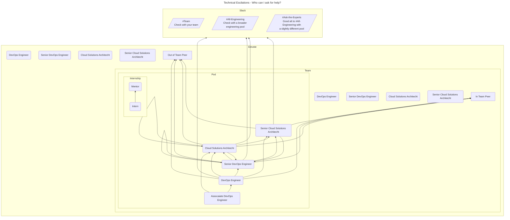

##### Text

```
---
title: Technical Escilations - Who can I ask for help?
---
flowchart BT
    intern("Intern")
    mentor("Mentor")
    aDOE("Assocaiate DevOps Engineer")
    DOE("DevOps Engineer")
    sDOE("Senior DevOps Engineer")
    CSA("Cloud Solutions Architecht")
    sCSA("Senior Cloud Solutions Architecht")
    tChan[/"#Team\nCheck with your team"/]
    allEng[/"#All-Engineering\nCheck with a broader engineering pool"/]
    askExp[/"#Ask-the-Experts\nGood alt to #All-Engineering with\na slightly different pool"/]

    subgraph slack["Slack"]
        tChan
        allEng
        askExp
    end

    subgraph internship["Internship"]
        direction BT
        intern-->mentor
    end

    subgraph pod["Pod"]
        internship

        aDOE-->DOE & CSA
        DOE-->sDOE & CSA & sCSA
        CSA-->CSA & sDOE & sCSA
        sDOE-->sDOE & CSA & sCSA
        sCSA-->sDOE
    end

    subgraph team["Team"]
        pod

        tDOE("DevOps Engineer")
        tsDOE("Senior DevOps Engineer")
        tCSA("Cloud Solutions Architecht")
        tsCSA("Senior Cloud Solutions Architecht")

        DOE & sDOE & CSA & sCSA-->tPeer["In Team Peer"]
    end

    subgraph elevate["Elevate"]
        team

        eDOE("DevOps Engineer")
        esDOE("Senior DevOps Engineer")
        eCSA("Cloud Solutions Architecht")
        esCSA("Senior Cloud Solutions Architecht")

        DOE & sDOE & CSA & sCSA--->ePeer["Out of Team Peer"]
    end

    DOE & sDOE & CSA & sCSA---->slack
```

### C4

C4 is a diagram style inspired by UML, this was simplified and paterned on
mulitiple layers of deeper diagrams. It also does away with UMLs proscriptive
guidence on meaning, you can use whatever shapes and types of lines you would
like with C4 as long as you are consistant. C4 has four layers of diagram,
those are Context, Container, Component and Code. Context is the high level
outline, it is non-technical, should make since to all stake holders and fixes
the scope and context of a single system. Container is the next level down,
provides the high level technical detail, how your system communicates with
other systems and can be thought of as a single deployable unit (terraform
module). This is normally enough for most uses but if you want to go deeper
the Component layer is for illistraiting the technical highlights and major
components of each container, followed by the Code layer which which zooms in
to the layer of each element in a given Component layer component. These lower
layers are often unnecicary and quickly grow oudaated as the project
progresses.

I am particularly excited about the ability to add links to nodes in the
diagrams, this allows for each component of a diagram to link to the
assocaited lower level diagram as we will see in the following examples.

#### Context

This is again, the high level overview from a non-technical prospective. It
provides context for the work as well as the scope. The major components here
that we are likely to work with are users, external services, aws accounts,
aws services, terraform modules as deployeable units of function. Another way
to look at this would be as a single "Workload" in the AWS WAFR framework.

`cmd + click` on the "Application" node will open a new tab for the
application Container diagram.

##### Diagram

Basic three tier web arch with CDN

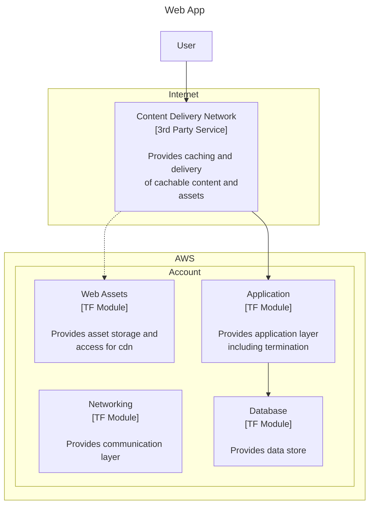

##### Text

```
---
title: Web App
---
flowchart TD
	user["User"]
    
    cdn["Content Delivery Network
    [3rd Party Service]
    
    Provides caching and delivery
    of cachable content and
    assets"]
    
    assets["Web Assets
    [TF Module]

    Provides asset storage and
    access for cdn"]

    network["Networking
    [TF Module]

    Provides communication layer"]

    web["Application
    [TF Module]

    Provides application layer
    including termination"]

    data["Database
    [TF Module]

    Provides data store"]

    user-->cdn
    subgraph internet["Internet"]
        cdn
    end
    subgraph aws["AWS"]
        subgraph account["Account"]
            network
            cdn-->web
            cdn-.->assets
            web-->data
        end
    end

    %% Add click action to a node
    click web href "#user-content-c4-container-diagram" "Open this modules diagram" _blank
```

#### Container

This is where we get into the body of the technical implementation, this level
is where we show the major components of a single deployable unit. In terrafrom
this would be the module level and can/should show the main services in use,
the interactions eabled as well as the inputs/outputs.


##### Diagram <div id="c4-container-diagram">

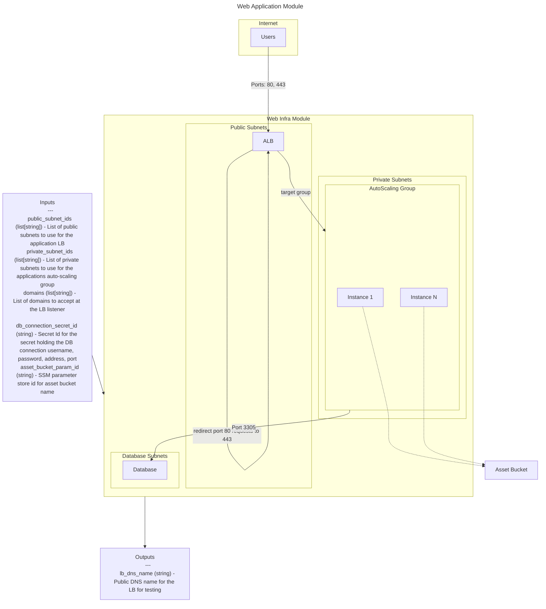

##### Text

```
---
title: Web Application Module
---
flowchart TD
    input["Inputs
    ---
    public_subnet_ids (list[string]) - List of public subnets to use for the application LB
    private_subnet_ids (list[string]) - List of private subnets to use for the applications auto-scaling group
    domains (list[string]) - List of domains to accept at the LB listener
    db_connection_secret_id (string) - Secret Id for the secret holding the DB connection username, password, address, port
    asset_bucket_param_id (string) - SSM parameter store id for asset bucket name"]

    output["Outputs
    ---
    lb_dns_name (string) - Public DNS name for the LB for testing"]

    input-->module---->output

    subgraph module["Web Infra Module"]
        subgraph public["Public Subnets"]
            lb["ALB"]
        end
        subgraph private["Private Subnets"]
            lb--"target group"-->asg
            subgraph asg["AutoScaling Group"]
                i1["Instance 1"]
                iN["Instance N"]
            end
            lb--"redirect port 80 requests to 443"-->lb
        end
        subgraph db["Database Subnets"]
            asg--"Port 3305"-->Database
        end
    end
    subgraph internet["Internet"]
        direction TB
        Users--"Ports: 80, 443"---->lb
    end

    i1 & iN -.-> bucket["Asset Bucket"]
```

#### Component

A major component of a container 
May not be needed depending on the use
Diagram
Diagram as text

# Questions?
