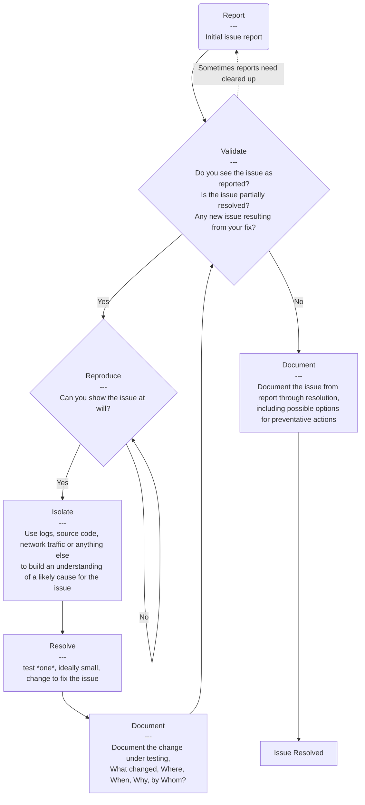

# Troubleshooting

Troubleshooting, the art and science of fixing problems.

Troubleshooting is a cyclic activity, you will keep iterating on the same
activity until you complete, then possibly cycle back through the prior
steps to validate.

## The High Level Cycle

### Initail Issue Report

This is where the issue you are troubleshooting is first reported. This could
be a ticket, a customer request in an email, slack, call, an alert from a
monitoring service. There are other sources but these are the most common and
where we will focus. The main thing that diferentiates these is the level of
detail and the ability to interogate the source for more information.

If it is a ticket you _should_ have all of the information needed to complete
the task. This does not mean you will not need to go looking for any but that
you should have the required information to find any needed information, a
firm understanding of the problem and the acceptence criteria for your
resolution.

If the report is coming from a customer you will need to get all of the
above from them. Ideally this is done on the spot in a clear and insightful
way. You should be able to reach out to the customer to have any missed detail
filled in but repeated requests both slow the troubleshooting process with
external delays and can impact the way the customer views us.

Alerts are rather hit or miss, they can be *very* specific, vague and unhelpful
possibly all at the same time. Alternetly they can have exactly the information
needed in just the order and detail needed to resolve the issue, including a in
some cases a link to the resolution procedure.

### Validate

### Reproduce

### Isolate

### Resolve

### Document

### Issue Resolved
